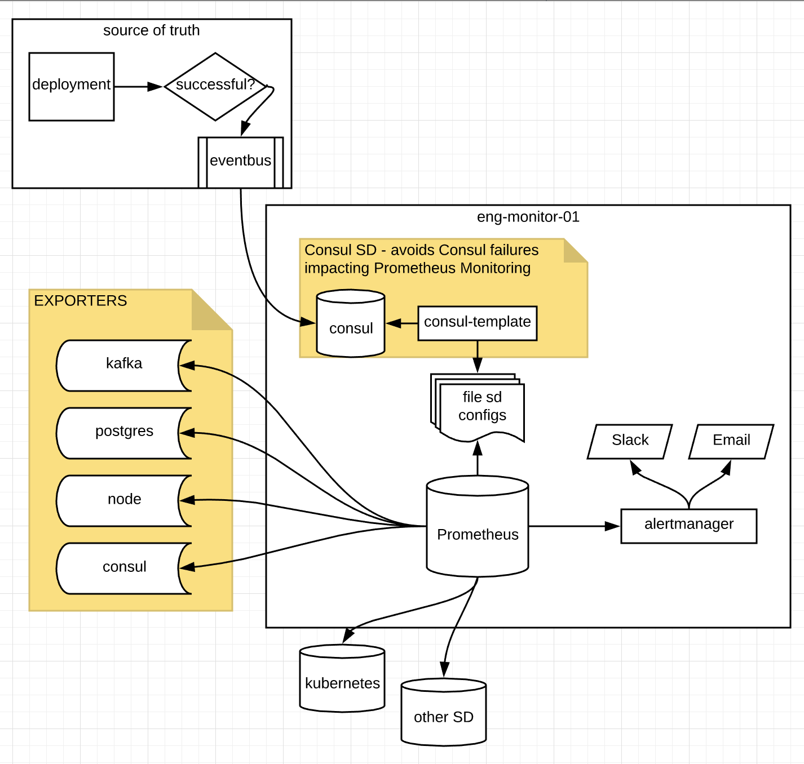

# PromStack

PromStack is a collection of software intended to provide a full featured platform for monitoring, alerting and logging of alerts.

> PromStack is NOT associated with the Prometheus group, though I do utilize Prometheus and their awesome software (given the name being 'Prom'Stack!)

**Table of Contents**

* <a href="#description">Description</a>
* <a href="#getting-started">Getting Started</a>
* <a href="#status-and-contributing">Status and Contributing</a>

## Description

As mentioned before, PromStack is a collection of software intended to provide a full featured platform for monitoring, alerting and logging of alerts.  Most of the software in this collection are highly considered in their respective markets, though I (which hopefully turns into a collective 'we') still might change pieces as time moves along to optimize and offer more/better functionality as it comes along.

### A quick look at the Stack

#### Monitoring with Prometheus

If you are looking at this page, [Prometheus](https://prometheus.io) should be pretty well known to you by now.  Prometheus is an open-source monitoring solution that scrapes a configured endpoint for Metrics and allows the user to configure rules and alerts based off of those metrics.

#### Service Discovery with Consul

[Consul](https://www.consul.io/intro/index.html) is a lot of things.  However in PromStack, I am utilizing Consul for its Service Discovery via the Consul Catalog for Nodes and Services as well as the DNS provided from the Catalog functionality.  One issue with Consul I noticed during the BETA process was that when Consul went down, the rest of my Prometheus monitoring would follow.  I believe this was due to the `evaluation_interval`, and wanted to make a change to avoid a single point of failure in my monitoring solution.  Therefore for non-container entities (which I need to heavily monitor at this time), I started using consul-template to write out simple files and use `file_sd_config`.  This way, changes in deployments propagate out to Prometheus, but in such a way where Consul can fail without impact the rest of the PromStack ecosystem.

#### Alerting with AlertManager

[AlertManager](https://prometheus.io/docs/alerting/alertmanager/) is a tool that handles Prometheus alert events and sends the events off to receivers based on labels defined in AlertManager's configuration.

#### Visualization with Grafana

[Grafana](https://grafana.com) is an open-source graphing tool for time series analytics.  Grafana creates be-u-T-ful graphs from Prometheus Metrics.

#### Experimental Pieces

##### Logging w/ Webhook

[Alerta](http://alerta.io) was originally investigated for long-term historic reporting of alerts and how long it took to resolve.  This has been deprecated at the time due to enhancements made in Prometheus' 2.0 release that enables the end-users to store more metrics over a period of time, eliminating a lot of the need for historic logging.  That being said, I am not investigating the idea of a webhook which pushes alert and resolution statistics to Logstash for Elasticsearch storage.

##### Tools

**[PromstackCTL](https://github.com/jbkc85/promstackctl)**: GoLang utility to add pre-defined exporters (configured in Consul KV store) to machines in your cluster.

*NOTE*: This is undergoing heavy modifications after reading into some of [Percona's Monitoring and Management](https://www.percona.com/doc/percona-monitoring-and-management/architecture.html) solution, as they did a great job in their implementation.

### More Information

As PromStack comes out of BETA, more documentation will become available.  Otherwise, please feel free to email me at jbkc85 at gmail.com with any questions, or drop an issue/comment in the github repo!

## Status and Contributing

The current status of PromStack is that it is in **beta**.  Since there are parts that I have deemed 'experimental', I do not wish to say it is 100% stable at this time.  Though, with that being said, running these components in production should provide a stable monitoring and alerting environment, as Alerta (being the logging portion) is the only part under review.

### Contributing

Feedback is greatly appreciated, so please email jbkc85 at gmail.com or open an issue.  Documentation is ongoing, but if you feel like something is lacking please let us know!

### Acknowledgements and other Solutions

I decided to write our deployment of PromStack after reading Percona's [Monitoring and Management](https://www.percona.com/doc/percona-monitoring-and-management/deploy/index.html) write-up.  A lot of the features between the two stacks are similar, and I figured writing the solution up might help others as well as benefit myself in the long run to get feedback on what everyone else out there is doing.

